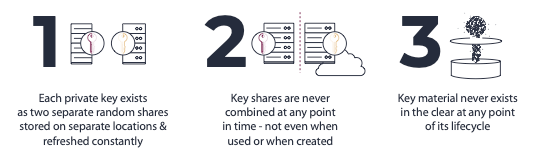
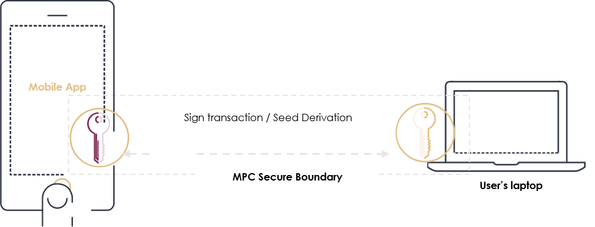
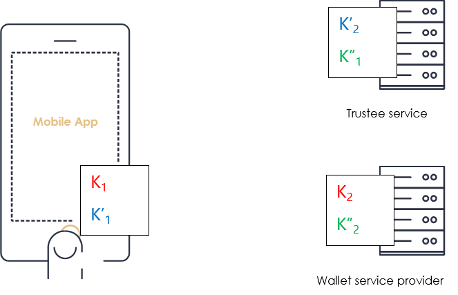
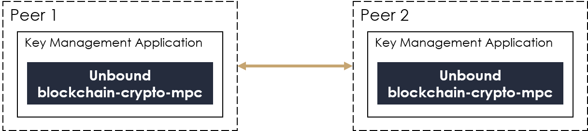
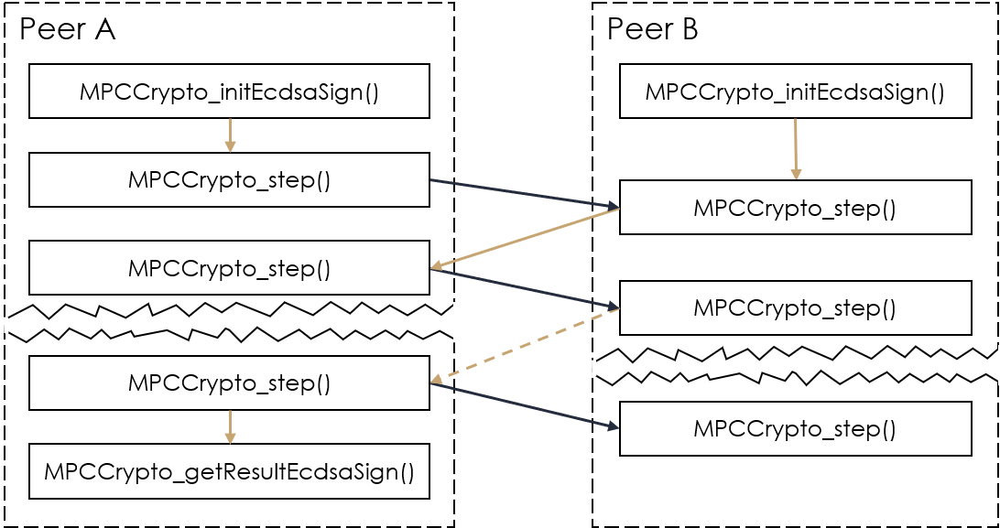

# 1. Introduction to *blockchain-crypto-mpc*

**blockchain-crypto-mpc** is an open source library released by [Unbound
Tech](https://www.unboundtech.com/company/about/) that provides the
cryptographic foundation to resolve one of the hardest challenges
associated with crypto asset and blockchain applications: **The
protection of cryptographic signing keys and seed secrets**.

Unbound leverages [secure multiparty computation
(MPC)](https://www.unboundtech.com/technology-distributed-trust-platform/)
for the protection and management of cryptographic keys and secrets, and
provides industry-grade MPC-based solutions for key management, key
protection and additional applications. The protocols were designed by
[Prof. Yehuda Lindell](https://en.wikipedia.org/wiki/Yehuda_Lindell) and
Dr. Samuel Ranellucci, who also reviewed and approved the code and the
implementation.

This readme includes an overview of this library, why it is important,
what it allows you to achieve, sample use cases, and how to use the
library (high level description).

**Note**: This is a preview release, including the API, but not the full
source code and documentation. Full documentation and source code will
be released shortly.

# 2. Who Should Use it? 

**Blockchain Crypto MPC provides 100% of the cryptography needed for
strongly securing crypto asset and blockchain wallets -- while being as
or more secure than dedicated cryptographic hardware -- for free**. If
you're developing a wallet or a platform for custody/exchanging of
crypto assets -- you're in the right place!

Leveraging MPC for the protection of cryptographic keys and secrets,
**blockchain-crypto-mpc** provides the security benefits of no single
point of compromise and shared responsibility (like Multi-Sig), but with
a single signature and without any dependency on the ledger. More
specifically, it provides three critical security properties:

1.  Sensitive keys and secrets are split into two random shares, which
    are stored on separate, segregated machines ('machine' stands for
    any computing device). Each of these shares by itself reveals
    nothing whatsoever about the key material.

2.  All cryptographic operations performed throughout the key lifecycle
    are performed without ever combining these 2 shares together. This
    includes signing, derivation and even generation. **Bottom line --
    there is no complete key material or secret in the memory, ever**.
    **It is proven mathematically that obtaining the key material
    requires access to both key shares,** **and therefore requires
    compromising both machines.** A single machine, even if completely
    compromised and controlled by an attacker, reveals nothing about the
    key material -- simply because the key material **never** resides in
    any single machine.

3.  Key shares refresh: The key shares are continually modified without
    modifying the key itself. It is computationally efficient and can be
    performed very frequently -- thus forcing the attacker to compromise
    both machines at virtually the same time in order to obtain key
    material.

**blockchain-crypto-mpc** includes a secure MPC implementation of 100%
of the functionality required to strongly secure crypto asset and
blockchain wallets. It's pure software, open-source and free to use.

It is highly recommended for developers of wallets and blockchain
applications that deal with key management.

**We are delighted to make this contribution to the open source
community, with hopes that it will enable secure, convenient, and easy
to use blockchain applications for all.**

# 3. What's Included?

**blockchain-crypto-mpc** includes a secure MPC implementation of the
following algorithms:

-   2-party ECDSA secp256k1: generation and signing

-   2-party EdDSA ed25519: generation and signing

-   2-party BIP32 (based on the [BIP32 specification](https://github.com/bitcoin/bips/blob/master/bip-0032.mediawiki)): generation, hard
    derivation, and normal derivation

-   Key share refresh

-   Zero-knowledge backup

The source code is written in C++ and the external API in C. Detailed
documentation including a whitepaper and security proofs will be
available online soon.

It can be compiled on virtually any platform. The only dependency is
OpenSSL, which is available on most platforms. Instructions on how to
remove this dependency will be included in future documentation.

The compiled binary is a cryptographic library that has to be deployed
on two or more separate machines to provide strong security.

# 4. What are the Typical Use Cases?

**blockchain-crypto-mpc** can be used to provide security in any blockchain
app. In this section we describe typical use cases that are relevant to
many applications.

## 4.1 Endpoint/Server Use Case 

This use case is common for wallet service providers. The user has a
mobile wallet on their endpoint device, typically their mobile phone or
laptop. The wallet application communicates with a server application.

### 4.1.1 Suggested setup:

The BIP32 seed and all signing keys are always split between the end
user's device (participant 1) and the service provider (participant 2).
Performing any cryptographic operation on the seed or private key
requires cooperation of both participants (and communication between
them).

### 4.1.2 Use Case Properties

-   Guaranteed non-repudiation; the application server cannot sign any
    transaction without cooperation from the endpoint device.

-   No single point of compromise: Compromising the seed or key material
    requires the attacker to compromise both the server and the endpoint
    simultaneously.

-   No key or seed material ever appears in the clear throughout its
    lifecycle, including while in use and during generation.

-   Resilient to side-channel attacks.

-   A model that empowers a crypto service provider to create an
    excellent user experience by delivering a wallet service while
    maintaining a very high security level and granting the users full
    control of their crypto assets.

## 4.2 Mobile/Laptop Use Case

This is a use case involving two end-user devices that typically belong
to the same user. For example, a mobile phone and a laptop. Each device
runs an app and both participants collaborate to create a secure
blockchain wallet and sign transactions.

### 4.2.1 Suggested Setup

The BIP32 seed and all signing keys are always split between the mobile
device (participant 1) and the laptop (participant 2). Performing any
cryptographic operation on the seed or private key requires cooperation
of both participants (and communication between them).

### 4.2.2 Use Case Properties

-   Both devices must collaborate and approve any transaction. No single
    device can approve a transaction.

-   No single point of compromise: Compromising the seed or key material
    requires the attacker to compromise both the laptop and the mobile
    device simultaneously.

-   No key or seed material ever appears in the clear throughout its
    lifecycle, including while in use and during generation.

-   Resilient to side-channel attacks.

-   A model that empowers a wallet provider to create an excellent
    user experience while maintaining a very high security level and
    granting the users full control of their crypto assets.

## 4.3 Backup

Backup is one of the most challenging aspects of crypto asset key
management. This section briefly describes the backup functionality of
**blockchain-crypto-mpc** and two potential usage scenarios.

**blockchain-crypto-mpc** includes a unique backup mechanism that introduces
zero-knowledge backup: an encrypted cold backup that allows public
verifiability. This property is significant, as it allows both
participants to verify the correctness of the backup at any point in
time without decrypting it. It therefore makes this verification secure
and prevents a situation where a wrong backup was generated and stored.

### 4.3.1 Backup Use Case 1: User-Managed

This is a common form of backup, with the role of backup management
mostly on the end-user. An encrypted backup of the wallet can be stored
in multiple locations for redundancy (for example, it can be stored by
the service provider as described in the Endpoint/Server use case). The
private key for this backup should be in the user's sole possession,
preferably in a cold backup. The backup recovery process should be used
only for disaster recovery.

### 4.3.2 Backup Use Case 2: Managed Backup

The following scenario is an expansion of the Endpoint/Server use case
that includes a 3rd party trustee service. The trustee service is used
only when either the user's device and/or the service provider have lost
their respective key shares.

This model creates a user-transparent backup, effectively similar to a 2-of-3 scenario: each quorum containing 2 of the 3 participants noted above would suffice to perform a cryptographic operation. This is performed by creating three different random share pairs upon wallet and seed generation. In the diagram, key share A is used by the user's device and the Trustee Service, key share B is used by the user's device and the Wallet Service Provider, and key share C is used by the Wallet Service Provider and the Trustee Service. It's important to highlight that each of these pairs is completely independent, each is effectively a backup of the same seed.

# 5. Technical Overview and Usage Guidelines

Unbound's Blockchain Crypto MPC open source library provides functions
that enable you to create, sign, and refresh encryption keys, without
the whole key ever existing in any location.

This library can be used to create system with two peers for the
management of the keys. Each peer uses the library to create and process
messages that are sent between the peers. Note that the actual
communication between peers is not included in this library.

## 5.1 Definitions

Blockchain Crypto MPC utilizes the following three structures:

1.  **Key share** -- Encryption keys never exist as complete keys in any
    phase of the process or in any location at any time. A key share is
    a piece of a key, which can be used by Unbound's MPC technology to
    sign transactions.

2.  **Message** -- Data that is passed to the other peer. The message
    contains information about the action in progress.

3.  **Context** -- Since each action, such as signing with a key,
    involves multiple messages between the two peers, the status of the
    action is preserved in a context.

The **key share**, **message**, and **context** contain varying amounts
of information depending on the type action, and therefore they are
structures.

## 5.2 Actions

The library provides the following actions:

-   2-party ECDSA secp256k1: generation and signing

-   2-party EdDSA ed25519: generation and signing

-   2-party BIP32 (based on the [BIP32 specification](https://github.com/bitcoin/bips/blob/master/bip-0032.mediawiki)): generation, hard
    derivation, and normal derivation

-   Key share refresh

-   Zero-knowledge backup

The library also provides mechanisms to handle serialization,
deserialization, and memory management for the key share, message, and
context structures.

## 5.3 System Flow

The system flow is shown in the following figure:

The first step is initialization. During this step you provide the
library with all the relevant information required to complete the
desired action. This step takes that information and creates a
**context**. Each peer does its own initialization.

The context is then passed through a series of steps. Each of these
steps takes an **input message**, does some manipulation, and then
creates an **output message**. You then transfer this output message to
the other peer. The other peer receives the message and associates it
with a context. It then knows how to handle the incoming message based
on the context.

When the peer is done with the last step it sets a finished flag. The
peer can then do any necessary cleanup, such as freeing memory, or
copying an updated key share to storage.

### 5.3.1 Peer Roles

Peer roles are determined by which peer initiates key generation. This peer must be used for any subsequent key operations, such as signing, derivation, and backup. For example, if peer A generates a key and then peer B wants to initiate a signing process, it should make a request to the peer A to start the process. When complete, the peer A can send the result to peer B. Peer B can verify this result with the *verify* function.

### 5.3.2 Detailed Flow

A detailed flow is described in the following procedure:

1. Peer A calls the relevant initialization function.
1. Peer A calls the step function, with a null **input message**, and gets an **output message**.
1. Peer A sends the **operation details** and its **output message** to peer B.
    - Note that the **operation details** are sent in this step. This information enables peer B to run the initialization function. Alternatively, this information can be sent any time before the next step.
1. Peer B verifies the **operation details** and consents to execute it.
1. Peer B calls the initialization function.
1. Peer B calls the **step** function with the message it received from peer A as **input message**.
1. Peer B sends the **output message** back to peer A.
1. Each peer alternates calling the **step** function with the **input message** from the other peer and then sending the **output message** to the other peer.
1. This ping-pong process continues until both peers are finished, which is determined by output flags from the **step** function. 
	- The *mpc_protocol_finished* flag denotes that it was the last step on this peer.
	- If it also includes the *mpc_share_changed* flag then the local key share  changed, such as with a *refresh* action. The key share needs to retrieved from the context using the **getShare** function and stored for future use.
	- If the output message from the last step is not empty it must be sent to the other peer.
	- One or both peers may need to call the **getResult** function based on the type of operation. For example, a *sign* action only has a result for one peer, but a *refresh* action has a new key share for both peers.

	
Throughout the entire process the same context should be used. If the context needs to be stored, you can use the **serialization** function, and then read it back in using the **deserialization** function.

### 5.3.3 Example Action

An example of an ECDSA signing action is shown in the following figure.

Each peer starts by calling the **MPCCrypto_initEcdsaSign()** function 
for initialization. After initialization, each peer calls the 
**MPCCrypto_step()** function a number of times until the peer is 
finished with the signing process. The signature, which is the result of 
the signing process, is received by calling the final function, 
**MPCCrypto_finalEcdsaSign()**, after which the signing process is done.
